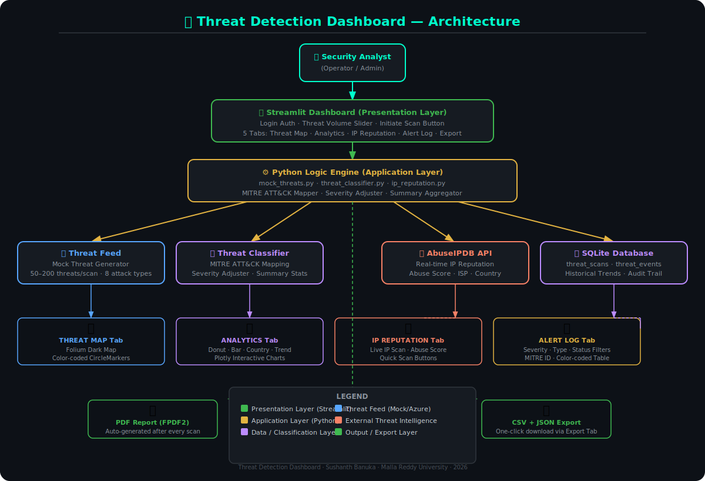
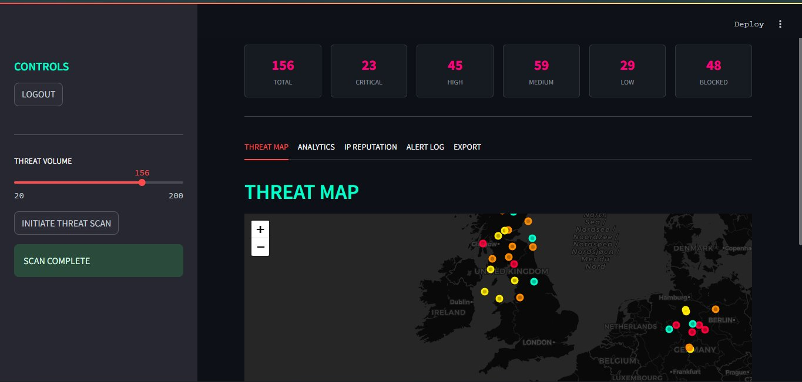
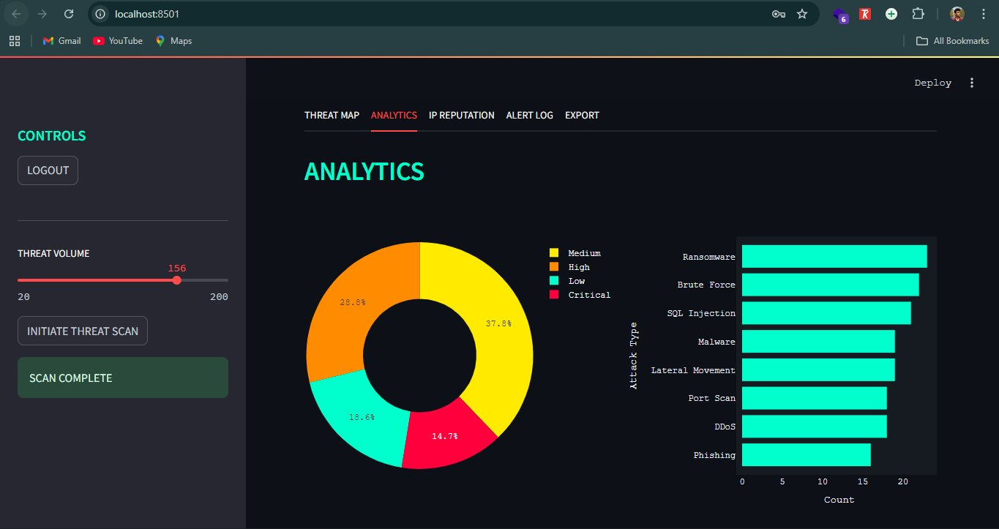
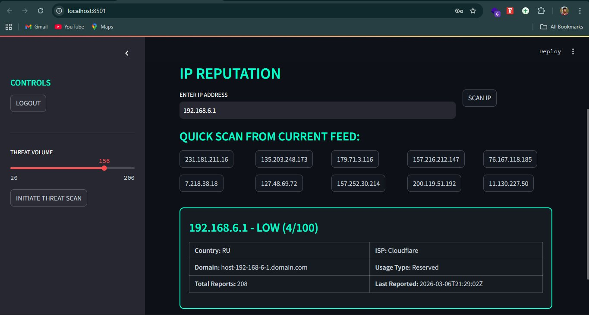
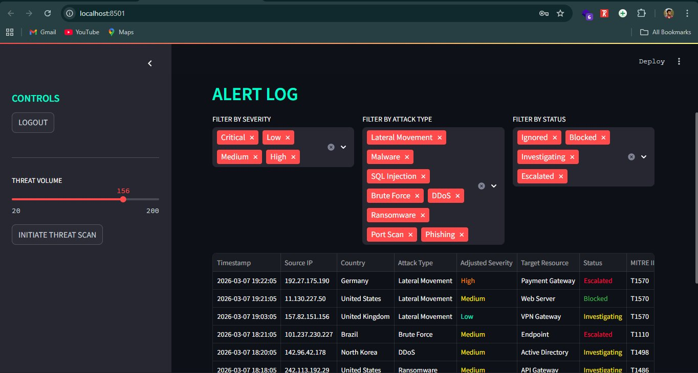

# 🛡️ Threat Detection Dashboard


# Project Description & Purpose

The **Threat Detection Dashboard** is a real-time cybersecurity visualization tool that simulates, classifies, and maps global attack data using the **MITRE ATT&CK framework** and **AbuseIPDB threat intelligence**. It solves the critical problem of alert fatigue by transforming raw security event data into an interactive, prioritized, and geographically mapped interface built for rapid incident response.

This project is the **direct analytical companion** to the [Azure Cloud Misconfiguration Scanner](https://github.com/Sushanth-Banuka/cloud-misconfiguration-scanner) — while the Scanner identifies vulnerable cloud resources, this Dashboard detects and visualizes the active threat actors attempting to exploit them, providing a complete end-to-end cloud security monitoring workflow.


# Demo Video

> **Watch the full walkthrough of the Threat Detection Dashboard in action:**

[](https://youtu.be/PwjSBuUQvc8)

*(https://youtu.be/PwjSBuUQvc8)*


# Architecture Diagram



*System Flow:* Security Analyst → Streamlit Dashboard → Python Logic Engine → Threat Classifier (MITRE ATT&CK) + AbuseIPDB API (IP Reputation) + Mock/Azure Threat Feed → SQLite (persistent logging) → PDF Report + CSV + JSON Export


# Dashboard Interface

# Threat Map — Global Attack Origin Visualization

*Real-time global threat map built with Folium on a dark CartoDB tile layer. Each marker represents a detected attack, color-coded by severity — Red (Critical), Orange (High), Yellow (Medium), Cyan (Low). Hovering reveals attack type, source IP, country, target resource and status. Metrics row displays Total, Critical, High, Medium, Low and Blocked counts.*

# Analytics — Threat Intelligence Charts

*Interactive Plotly analytics panel showing: Severity Distribution donut chart with percentage breakdown, Attack Type Frequency horizontal bar chart ranked by occurrence, Top 10 Threat Origin Countries bar chart, and Historical Threat Trends line chart powered by SQLite scan history.*

# IP Reputation — Live AbuseIPDB Lookup

*On-demand IP reputation intelligence powered by AbuseIPDB. Enter any suspicious IP to instantly retrieve its abuse confidence score, country, ISP, domain, usage type and total community reports. Quick-scan buttons auto-populate IPs from the current threat feed for one-click investigation.*

# Alert Log — Detailed Incident Table

*Full filterable incident table with multi-select filters for Severity, Attack Type and Status. Each row displays Timestamp, Source IP, Country, Attack Type, MITRE ATT&CK ID, Adjusted Severity, Target Resource and Status — all color-coded for rapid triage. Includes Escalated, Blocked and Investigating status tracking.*


# Detected Threat Types & MITRE ATT&CK Mapping

This dashboard detects and classifies the following threat categories. Each is mapped to its official MITRE ATT&CK technique ID for standardized threat communication:

| Attack Type | MITRE ID | Description | Severity Impact |
| :--- | :--- | :--- | :--- |
| **Brute Force** | T1110 | Repeated credential guessing attempts to gain unauthorized access | Variable (Low–High) |
| **Port Scan** | T1046 | Systematic network scan to discover open ports and running services | Low |
| **SQL Injection** | T1190 | Malicious SQL queries injected into web application inputs to manipulate databases | Critical |
| **DDoS** | T1498 | High-volume network flood to degrade or deny service availability | High |
| **Malware** | T1204 | Malicious software executed to compromise, exfiltrate or destroy data | High |
| **Phishing** | T1566 | Deceptive communications to trick targets into revealing sensitive credentials | Medium |
| **Ransomware** | T1486 | Encryption of victim data with ransom demanded for decryption key | Critical |
| **Lateral Movement** | T1021 | Attacker pivoting through internal network after initial compromise | High |


# Technologies Used

- **Python:** Core scripting and automation language
- **Streamlit:** Dark-mode futuristic dashboard UI with tab-based navigation
- **Plotly:** Interactive charts — donut (severity), bar (attack types, countries), line (trend history)
- **Folium + streamlit-folium:** Interactive global threat map with dark CartoDB tiles and severity-coded markers
- **AbuseIPDB API:** Real-time IP reputation intelligence — abuse score, ISP, country, usage type
- **SQLite3:** Persistent local database for historical scan logging and trend analysis
- **FPDF2:** Automated PDF incident report generation after every scan
- **Pandas:** Data manipulation, filtering and CSV/JSON serialization
- **python-dotenv:** Secure credential and API key management via `.env` file


# Installation & Usage

# 1. Prerequisites
Ensure you have **Python 3.11+** installed. Optionally configure Azure CLI (`az`) for live Azure Monitor log integration.

# 2. Clone the Repository
```bash
git clone https://github.com/Sushanth-Banuka/threat-detection-dashboard.git
cd threat-detection-dashboard
```

# 3. Set Up the Virtual Environment

**Windows (PowerShell):**
```powershell
python -m venv venv
.\venv\Scripts\Activate.ps1
```

**macOS/Linux:**
```bash
python3 -m venv venv
source venv/bin/activate
```

# 4. Install Dependencies
```bash
pip install -r requirements.txt
```

# 5. Configure Credentials
Duplicate the `.env.template` file to `.env`:
```bash
cp .env.template .env
```
Fill in your credentials inside the `.env` file:
```env
# Azure Credentials (for live Azure Monitor integration)
AZURE_SUBSCRIPTION_ID="your-subscription-id"
AZURE_TENANT_ID="your-tenant-id"
AZURE_CLIENT_ID="your-client-id"
AZURE_CLIENT_SECRET="your-client-secret"

# AbuseIPDB API Key (free at https://www.abuseipdb.com/)
ABUSEIPDB_API_KEY="your-abuseipdb-api-key"
```

 ⚠️ **Note:** The dashboard runs fully on mock threat data without any API keys. AbuseIPDB key is only required for live IP reputation lookups.


# 6. Launch the Dashboard
```bash
streamlit run dashboard/app.py
```
- **Default Operator ID:** `admin`
- **Default Passcode:** `cybersecurity`


# Project Structure

```
threat-detection-dashboard/
├── dashboard/
│   └── app.py                  # Main Streamlit UI — 5 tabs, auth, metrics
├── data/
│   └── mock_threats.py         # Realistic threat data generator (50–200 threats)
├── detectors/
│   ├── ip_reputation.py        # AbuseIPDB API integration + mock fallback
│   └── threat_classifier.py    # MITRE ATT&CK mapping + severity adjustment
├── reports/
│   ├── db.py                   # SQLite logging — scans + events tables
│   └── report_gen.py           # FPDF2 PDF report generator
├── .env                        # Your credentials (never commit this)
├── .env.template               # Credential template
├── requirements.txt
└── README.md
```


# Academic Publication

This dashboard is the threat visualization component associated with the following research paper:

> AUTONOMOUS CLOUD SECURITY POSTURE MANAGEMENT (ACSPM): An Event Driven Framwork For Real Time Misconfiguration Remedation
> 
> Mr. Sushanth Banuka
>
> https://ijnrd.org/papers/IJNRD2603361.pdf


*Disclaimer: This tool is for educational and authorized security research purposes only. Ensure you have explicit permission before scanning any live Azure environment or performing IP reputation lookups.*
